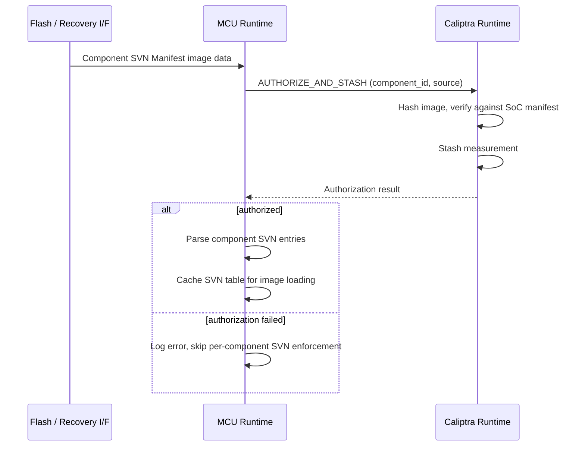
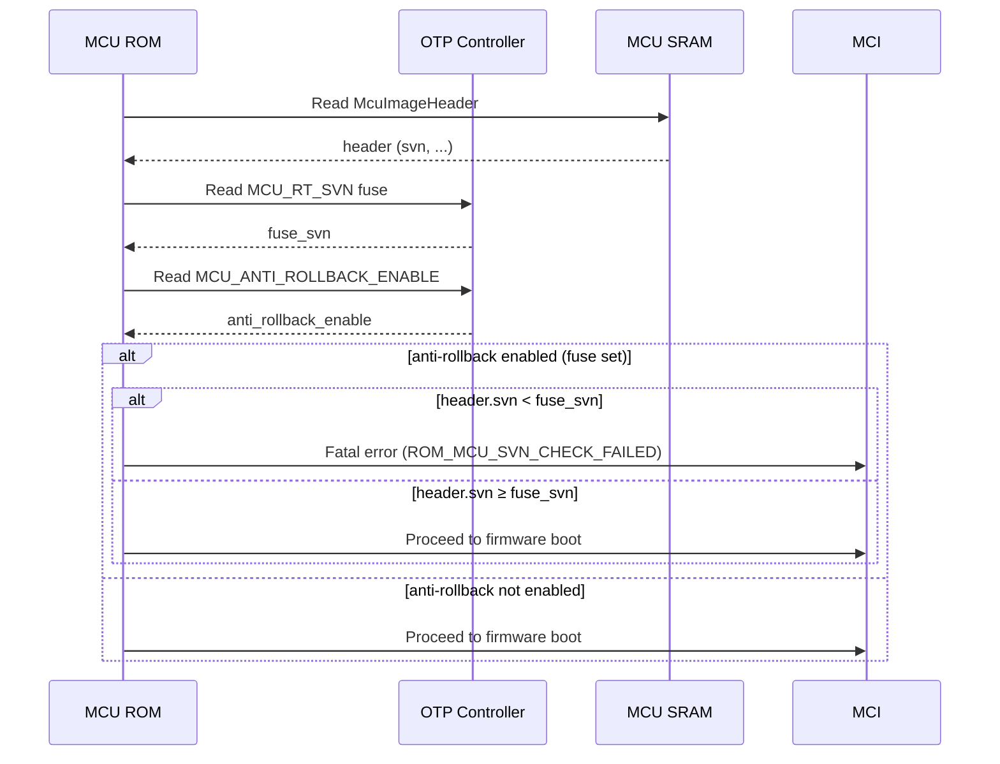
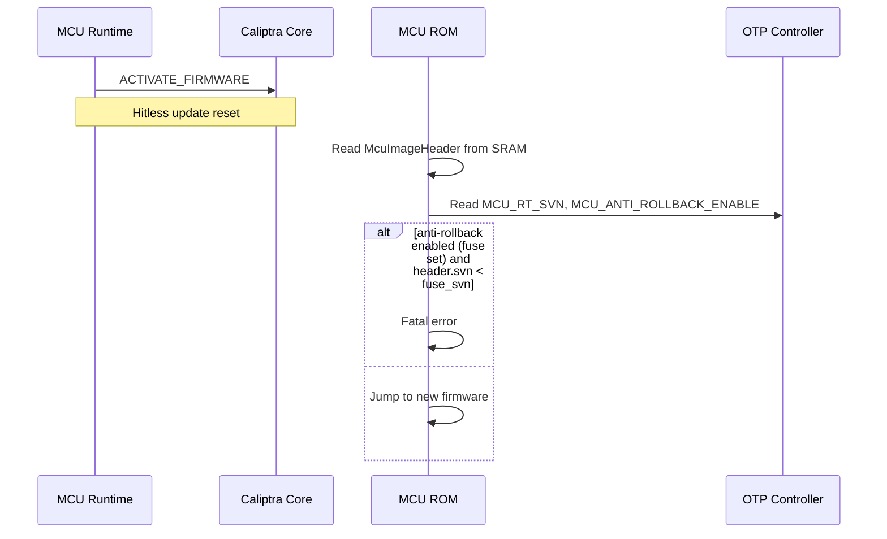

# Security Version Number (SVN) Anti-Rollback Specification

## Overview

Security Version Numbers (SVNs) provide anti-rollback protection for firmware
running on the Caliptra subsystem. An SVN is a monotonically increasing integer
stored in OTP fuses that establishes a minimum acceptable firmware version. Once
a device boots authenticated firmware at a given SVN, the OTP fuses are updated
so that older firmware with a lower SVN can never execute on that device again.

This document describes SVN enforcement for three categories of components:

1. **Caliptra Core firmware** (FMC, Runtime) — SVN enforcement is performed by
   the Caliptra Core ROM during its own boot.
2. **MCU Runtime firmware** — SVN enforcement is performed by the MCU ROM before
   jumping to MCU firmware.
3. **SoC component images** — The SoC manifest carries a single SVN enforced by
   Caliptra Core. Optionally, MCU Runtime can enforce per-component SVN checks
   using an MCU-managed component SVN manifest and dedicated fuses.

## Threat Model

SVN anti-rollback prevents an attacker who can manipulate the firmware delivery
path (e.g., flash contents, recovery interface, network boot server) from
downgrading firmware to an older version with known vulnerabilities. Without SVN
enforcement, an attacker could replace current firmware with a signed-but-older
image that contains exploitable bugs.

SVN enforcement relies on:

- OTP fuses as a tamper-resistant monotonic store
- Authenticated firmware images that carry a declared SVN
- ROM or runtime code that compares and enforces the SVN before executing or
  loading the image

## SVN Fuse Architecture

### Existing Caliptra Core SVN Fuses

The following SVN fuses already exist in the `SVN_PARTITION` (partition 8) of
the OTP fuse map and are owned by the Caliptra Core:

| Fuse Field | Size | Purpose |
|---|---|---|
| `CPTRA_CORE_FMC_KEY_MANIFEST_SVN` | 4 bytes | Anti-rollback for the Caliptra FMC key manifest |
| `CPTRA_CORE_RUNTIME_SVN` | 16 bytes | Anti-rollback for the Caliptra Runtime firmware |
| `CPTRA_CORE_SOC_MANIFEST_SVN` | 16 bytes | Anti-rollback for the SoC manifest |
| `CPTRA_CORE_SOC_MANIFEST_MAX_SVN` | 4 bytes | Maximum allowed SVN for the SoC manifest |

These fuses are read by MCU ROM during cold boot and written to Caliptra Core's
fuse registers. Caliptra Core ROM enforces anti-rollback for its own firmware
using these values. See [ROM Fuses](rom-fuses.md) for encoding details.

The `CPTRA_CORE_ANTI_ROLLBACK_DISABLE` fuse in `sw_manuf_partition` (partition
6) can disable Caliptra Core's anti-rollback enforcement entirely. When set,
Caliptra Core will not reject firmware with a lower SVN. This is a pre-existing
Caliptra Core fuse that MCU ROM passes through without interpretation.

> **Note:** The MCU-side anti-rollback fuse uses the opposite polarity —
> `MCU_ANTI_ROLLBACK_ENABLE` — following the principle that burning a fuse
> should only make a device *more* secure, never less. Since OTP bits can only
> transition 0→1, an "enable" fuse means enforcement can be permanently
> activated but never deactivated.

### New MCU SVN Fuses

To provide anti-rollback protection for MCU Runtime firmware and SoC component
images, the following new fuse fields are required. These should be added to a
vendor-defined partition (e.g., `VENDOR_NON_SECRET_PROD_PARTITION`) or to a new
dedicated MCU SVN partition, depending on the integrator's fuse budget.

| Fuse Field | Size | Encoding | Purpose |
|---|---|---|---|
| `MCU_RT_SVN` | 16 bytes | `OneHotLinearMajorityVote{bits:N, dupe:3}` | Anti-rollback for MCU Runtime firmware |
| `SOC_IMAGE_SVN[0..M]` | 4 bytes each | `OneHotLinearMajorityVote{bits:N, dupe:3}` | Anti-rollback for each SoC component image |
| `MCU_ANTI_ROLLBACK_ENABLE` | 1 byte | `LinearMajorityVote{bits:1, dupe:3}` | Enable MCU-side anti-rollback enforcement (burned during provisioning) |

The exact number of `SOC_IMAGE_SVN` slots (`M`) depends on the integrator's SoC
image configuration and is defined in the platform's fuse definition file. Each
slot corresponds to a component identifier in the SoC manifest.

#### Fuse Encoding Rationale

SVN fuses use `OneHotLinearMajorityVote` encoding because:

- **OneHot** allows incrementing the SVN by burning a single additional fuse bit,
  which is a safe monotonic operation on OTP.
- **LinearMajorityVote** with 3× duplication provides fault tolerance against
  single-bit read errors without requiring ECC (which is incompatible with
  fields that are written more than once).

See [Fuse Layout Options](fuses.md#fuse-layout-options) for encoding details.

#### OTP Encoding Recommendations

| Fuse Field | ECC | Recommended Layout |
|---|:---:|---|
| `MCU_RT_SVN` | ❌ | `OneHotLinearMajorityVote{bits:N, dupe:3}` |
| `SOC_IMAGE_SVN[i]` | ❌ | `OneHotLinearMajorityVote{bits:N, dupe:3}` |
| `MCU_ANTI_ROLLBACK_ENABLE` | ✅ | `LinearMajorityVote{bits:1, dupe:3}` or `Single{bits:1}` with ECC |

The `MCU_ANTI_ROLLBACK_ENABLE` fuse is write-once and can use ECC. SVN counter
fuses must not use ECC because they are updated in the field.

## MCU Image Header

The MCU Runtime binary includes an `McuImageHeader` at the start of the image.
This header carries the image's declared SVN:

| Field | Size | Description |
|---|---|---|
| `svn` | 2 bytes | Security version number of this MCU Runtime image |
| `reserved1` | 2 bytes | Reserved for future use |
| `reserved2` | 4 bytes | Reserved for future use |

The SVN value is set at build time via the firmware bundler's `--svn` option and
is embedded in the binary before it is signed and included in the firmware
bundle.

## SoC Image SVN Tracking

The SoC manifest carries a single SVN for the manifest as a whole
(`CPTRA_CORE_SOC_MANIFEST_SVN`), which is enforced by Caliptra Core. There is no
per-component SVN in the SoC manifest itself.

To provide per-component anti-rollback for individual SoC images, the MCU SDK
supports an optional **MCU Component SVN Manifest** — a small data structure
managed by MCU firmware that maps each SoC component identifier to an SVN value.

### MCU Component SVN Manifest (Optional)

| Field | Size | Description |
|---|---|---|
| Magic | 4 bytes | Identifier `0x4D435356` (`"MCSV"`) |
| Version | 2 bytes | Manifest format version |
| Entry Count | 2 bytes | Number of component SVN entries |
| Entries | 8 bytes × N | Array of `(component_id: u32, svn: u32)` pairs |

When present, MCU Runtime uses this manifest to enforce per-component SVN checks
against the `SOC_IMAGE_SVN[i]` fuses during image loading. When absent, only the
SoC manifest-level SVN (enforced by Caliptra Core) provides anti-rollback
protection for SoC images, and the `SOC_IMAGE_SVN` fuses are not used.

This is an optional extension — integrators who do not need per-component SoC
image anti-rollback can omit both the MCU Component SVN Manifest and the
`SOC_IMAGE_SVN` fuses.

### Loading and Authenticating the Component SVN Manifest

The MCU Component SVN Manifest is treated as a SoC image within the standard
firmware bundle. It is listed in the SoC manifest with its own component
identifier (e.g., a reserved identifier such as `0x00000003` or a
vendor-assigned value) and digest, alongside the other SoC images.

During boot or firmware update, the manifest is delivered and authenticated using
the same mechanisms as any other SoC image:

**Recovery / Cold Boot Flow:**

1. The MCU Component SVN Manifest is included in the flash image or streamed via
   the recovery interface alongside the other SoC images.
2. Caliptra Runtime loads the manifest data via the recovery interface registers
   and writes it to an MCU-accessible location (e.g., MCU SRAM or a
   DMA-accessible buffer).
3. MCU Runtime issues an `AUTHORIZE_AND_STASH` mailbox command to Caliptra,
   referencing the component identifier assigned to the SVN manifest. Caliptra
   hashes the image, verifies the digest against the SoC manifest entry, and
   stashes the measurement.
4. If authorization succeeds, MCU Runtime parses the manifest and caches the
   per-component SVN entries for use during subsequent SoC image loading.
5. If authorization fails, MCU Runtime treats the manifest as absent —
   per-component SVN enforcement is not applied, and an error is logged.

**PLDM Firmware Update Flow:**

1. The MCU Component SVN Manifest is included as a component in the PLDM
   firmware update package, delivered by the Update Agent alongside the other
   firmware components.
2. The manifest is written to the staging area and verified as part of the
   normal PLDM component verification sequence.
3. During the apply phase, MCU Runtime issues `AUTHORIZE_AND_STASH` to Caliptra
   for the SVN manifest component, following the same flow as above.

**Hitless Update Flow:**

1. When new firmware is activated via hitless update, the updated MCU Component
   SVN Manifest (if present in the new bundle) is authorized and loaded after
   MCU Runtime boots with the new firmware.



Because the MCU Component SVN Manifest is authenticated through the same
Caliptra `AUTHORIZE_AND_STASH` path as all other SoC images, its integrity is
rooted in the same trust chain — the SoC manifest signature verified by Caliptra
Core. An attacker cannot forge or tamper with the SVN manifest without also
compromising the SoC manifest signature.

## Enforcement Flows

### Cold Boot — Caliptra Core SVNs

During cold boot, MCU ROM reads the Caliptra Core SVN fuses from OTP and writes
them to Caliptra Core's fuse registers. Caliptra Core ROM then enforces
anti-rollback internally:

1. MCU ROM reads `CPTRA_CORE_FMC_KEY_MANIFEST_SVN`, `CPTRA_CORE_RUNTIME_SVN`,
   `CPTRA_CORE_SOC_MANIFEST_SVN`, and `CPTRA_CORE_SOC_MANIFEST_MAX_SVN` from
   OTP.
2. MCU ROM writes these values to the corresponding Caliptra fuse registers.
3. Caliptra Core ROM authenticates its firmware bundle and compares the
   image-declared SVN against the fuse SVN.
4. If image SVN < fuse SVN, Caliptra Core rejects the firmware.
5. If image SVN ≥ fuse SVN, Caliptra Core boots the firmware.
6. If image SVN > fuse SVN and `CPTRA_CORE_ANTI_ROLLBACK_DISABLE` is not set,
   Caliptra Core updates the SVN fuse in OTP to match the image SVN.

MCU ROM has no role in enforcing Caliptra Core SVN policy — it only transports
fuse values from OTP to Caliptra registers.

### Cold Boot — MCU Runtime SVN

After Caliptra Core loads the MCU Runtime image into MCU SRAM, MCU ROM enforces
the MCU SVN before jumping to firmware:

1. MCU ROM waits for Caliptra to signal that MCU firmware is ready in SRAM.
2. MCU ROM reads the `McuImageHeader` from the start of the loaded image.
3. MCU ROM reads `MCU_RT_SVN` from OTP and decodes the fuse value.
4. MCU ROM reads `MCU_ANTI_ROLLBACK_ENABLE` from OTP.
5. If anti-rollback is enabled (fuse is set):
   - If `header.svn < fuse_svn`: MCU ROM rejects the image and reports a fatal
     error (`ROM_MCU_SVN_CHECK_FAILED`). The device does not boot.
   - If `header.svn ≥ fuse_svn`: MCU ROM proceeds.
6. MCU ROM triggers a reset to enter the Firmware Boot flow, which jumps to the
   MCU Runtime.

**SVN fuse update for MCU Runtime** occurs after the firmware has successfully
booted and is described in [SVN Fuse Update Flow](#svn-fuse-update-flow) below.



### Firmware Boot — SVN Check on Jump

During the Firmware Boot flow (entered after cold boot triggers a reset), MCU
ROM performs a lightweight validation before jumping to firmware. The SVN check
has already been performed during the cold boot flow and does not need to be
repeated here, since SRAM contents have not changed.

### Hitless Firmware Update — MCU Runtime SVN

When an MCU Runtime update is applied via the hitless update mechanism:

1. MCU Runtime receives a firmware update via PLDM T5.
2. MCU Runtime sends the new firmware bundle to Caliptra for verification.
3. Caliptra authenticates the bundle and loads the new MCU Runtime to SRAM.
4. MCU Runtime triggers a hitless update reset.
5. MCU ROM enters the Hitless Firmware Update flow.
6. MCU ROM reads the `McuImageHeader` from the new image in SRAM.
7. MCU ROM reads `MCU_RT_SVN` and `MCU_ANTI_ROLLBACK_ENABLE` from OTP.
8. If anti-rollback is enabled and `header.svn < fuse_svn`:
   - MCU ROM rejects the update and reports a fatal error. The device must
     recover by loading firmware with an acceptable SVN.
9. If `header.svn ≥ fuse_svn`: MCU ROM jumps to the new firmware.



### Runtime — SoC Image SVN Enforcement (Optional)

When the MCU Component SVN Manifest is present and `SOC_IMAGE_SVN` fuses are
provisioned, MCU Runtime enforces per-component SVN checks during image loading:

1. MCU Runtime authenticates the MCU Component SVN Manifest (e.g., by verifying
   its digest against a value in the SoC manifest or via a Caliptra mailbox
   command).
2. For each SoC image to be loaded:
   a. MCU Runtime looks up the image's component identifier in the MCU Component
      SVN Manifest to obtain its declared SVN.
   b. MCU Runtime reads the corresponding `SOC_IMAGE_SVN[i]` fuse from OTP.
   c. If `manifest_svn < fuse_svn`: the image is rejected and not loaded to the
      target SoC component. An error is reported.
   d. If `manifest_svn ≥ fuse_svn`: the image is loaded normally.
3. The mapping from component identifiers to `SOC_IMAGE_SVN` fuse slots is
   defined by the platform configuration.

If the MCU Component SVN Manifest is not present, per-component SVN enforcement
is skipped. Anti-rollback for SoC images in this case relies solely on the
SoC manifest-level SVN enforced by Caliptra Core.

## SVN Fuse Update Flow

SVN fuses are updated (burned forward) only after firmware has successfully
booted and proven functional. This is a deliberate design choice: burning fuses
before successful boot could brick a device if the new firmware fails to
operate.

### When SVN Fuses Are Updated

| Component | Who Updates | When |
|---|---|---|
| Caliptra Core FMC/RT | Caliptra Core ROM | During Caliptra Core's own boot, before handing off to FMC |
| MCU Runtime | MCU Runtime (via OTP API) | After MCU Runtime has successfully booted and initialized |
| SoC images (optional) | MCU Runtime (via OTP API) | After the SoC image has been successfully loaded and activated (requires MCU Component SVN Manifest) |

### MCU Runtime SVN Update

After MCU Runtime successfully boots, it updates the `MCU_RT_SVN` fuse if the
running firmware's SVN exceeds the current fuse value:

1. MCU Runtime reads its own SVN from the `McuImageHeader` in SRAM.
2. MCU Runtime reads `MCU_RT_SVN` from OTP.
3. If `image_svn > fuse_svn`:
   a. MCU Runtime computes the new encoded fuse value by burning additional
      one-hot bits to represent the higher SVN.
   b. MCU Runtime writes the updated value to the `MCU_RT_SVN` fuse via the OTP
      DAI.
   c. MCU Runtime reads back the fuse value and verifies the update succeeded.
4. If `image_svn ≤ fuse_svn`: no fuse update is needed.

This update is idempotent and power-fail safe:

- Burning additional one-hot bits can only increase the SVN value.
- A partial burn (due to power loss) results in either the old value or a value
  between old and new, both of which are valid states — the full update will
  complete on the next boot.
- The majority vote encoding provides additional resilience against single-bit
  errors during the burn.

### SoC Image SVN Update (Optional)

When the MCU Component SVN Manifest is in use: after a SoC image is successfully
loaded and the downstream component signals readiness, MCU Runtime updates the
corresponding `SOC_IMAGE_SVN[i]` fuse following the same procedure as the MCU
Runtime SVN update.

## Platform Configuration

Integrators must define the following in their platform configuration:

### Fuse Definition (vendor_fuses.hjson)

```js
{
  non_secret_vendor: [
    {"mcu_rt_svn": 16},           // 16 bytes for MCU RT SVN
    {"soc_image_svn_0": 4},       // 4 bytes per SoC image SVN slot
    {"soc_image_svn_1": 4},
    // ... additional slots as needed
    {"mcu_anti_rollback_enable": 1}
  ],
  fields: [
    {name: "mcu_rt_svn", bits: 32},  // logical SVN range 0..32
    {name: "soc_image_svn_0", bits: 8},
    {name: "soc_image_svn_1", bits: 8},
    {name: "mcu_anti_rollback_enable", bits: 1}
  ]
}
```

The actual bit counts and number of SoC image SVN slots are
integrator-defined based on the expected firmware update frequency over the
device lifetime and the number of SoC components.

### Component SVN Fuse Map

ROM and MCU Runtime must be compiled with a static mapping from SVN component
identifiers to OTP fuse entries. This map tells the firmware which fuse slot
backs each component's SVN, and is required for both the MCU Runtime SVN check
(in ROM) and the per-component SoC image SVN checks (in MCU Runtime).

The map is defined as a platform-specific constant table:

```rust
/// Maps a component identifier to its OTP fuse entry for SVN storage.
pub struct SvnFuseMapEntry {
    /// Component identifier (matches the MCU Component SVN Manifest).
    /// Use a well-known value (e.g., 0x00000002) for the MCU Runtime itself.
    pub component_id: u32,
    /// Reference to the generated OTP fuse entry for this component's SVN.
    pub fuse_entry: &'static FuseEntryInfo,
}

/// Platform-defined SVN fuse map, compiled into ROM and runtime.
pub static SVN_FUSE_MAP: &[SvnFuseMapEntry] = &[
    SvnFuseMapEntry {
        component_id: 0x0000_0002, // MCU RT
        fuse_entry: &OTP_MCU_RT_SVN,
    },
    SvnFuseMapEntry {
        component_id: 0x0000_1000, // SoC image 0
        fuse_entry: &OTP_SOC_IMAGE_SVN_0,
    },
    SvnFuseMapEntry {
        component_id: 0x0000_1001, // SoC image 1
        fuse_entry: &OTP_SOC_IMAGE_SVN_1,
    },
    // ... additional entries as needed
];
```

ROM uses this map to resolve `MCU_RT_SVN` for the MCU Runtime SVN check at boot.
MCU Runtime uses it to resolve `SOC_IMAGE_SVN[i]` for each component when
processing the MCU Component SVN Manifest during image loading and when burning
SVN fuses after successful activation.

If a component identifier from the MCU Component SVN Manifest does not have a
corresponding entry in the fuse map, MCU Runtime skips per-component SVN
enforcement for that component and logs a warning. This allows the manifest to
list components that do not yet have dedicated fuse slots without causing boot
failures.

### McuImageHeader SVN Assignment

The firmware bundler's `--svn <value>` flag sets the SVN in the
`McuImageHeader`. The build system must increment this value whenever a security
fix is included in a firmware release.

### ImageVerifier Implementation

Each platform must implement the `ImageVerifier` trait to perform SVN
enforcement in ROM. The reference implementation reads the `McuImageHeader`,
extracts the SVN, reads the corresponding OTP fuse, and compares:

```rust
impl ImageVerifier for McuImageVerifier {
    fn verify_header(&self, header: &[u8], otp: &Otp) -> bool {
        let Ok((header, _)) = McuImageHeader::ref_from_prefix(header) else {
            return false;
        };
        let Ok(fuse_svn) = otp.read_mcu_rt_svn() else {
            return false;
        };
        if otp.read_mcu_anti_rollback_enable().unwrap_or(0) == 0 {
            return true; // anti-rollback not yet enabled
        }
        header.svn >= fuse_svn
    }
}
```

## Security Considerations

### SVN Update Timing

SVN fuses are updated **after** successful boot, not before or during the
authentication step. This prevents a scenario where a power failure during fuse
programming bricks the device by committing to a firmware version that cannot
actually run.

### One-Way Commitment

OTP fuses can only be burned from 0→1 (or equivalently, the SVN count can only
increase). There is no mechanism to decrease an SVN value. If a firmware release
with a given SVN is found to be defective, the only remedy is to release new
firmware with an SVN ≥ the committed value.

### Anti-Rollback Enable Fuse

The `MCU_ANTI_ROLLBACK_ENABLE` fuse must be burned during device provisioning
before the device enters production. Once set, anti-rollback enforcement is
permanently active and cannot be turned off — OTP fuses can only transition
0→1, so there is no mechanism to disable enforcement after it has been enabled.

On unprogrammed devices (development, early manufacturing), the fuse defaults to
0 and anti-rollback is not enforced, allowing unrestricted firmware iteration.
The lifecycle controller's transition from manufacturing to production should
verify that this fuse has been set.

### SVN Exhaustion

The maximum SVN value is limited by the number of fuse bits allocated. With
one-hot encoding:

- 32 bits → max SVN of 32
- 128 bits → max SVN of 128

Integrators must allocate enough bits for the expected number of security
updates over the device's operational lifetime. If the SVN reaches its maximum
value, no further anti-rollback updates are possible, but the device continues
to enforce the maximum SVN.

### Interaction with Device Ownership Transfer

SVN fuses are orthogonal to device ownership. Ownership transfer (DOT) does not
reset or modify SVN values. A new owner inherits the device's current SVN state
and must provide firmware with SVNs ≥ the committed values.
