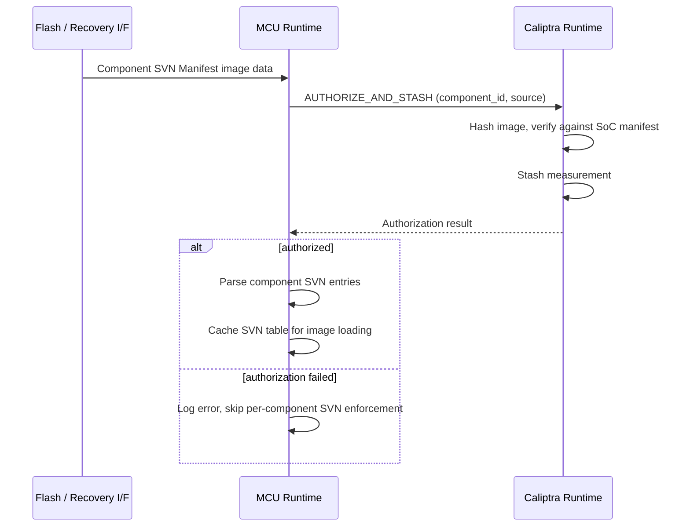
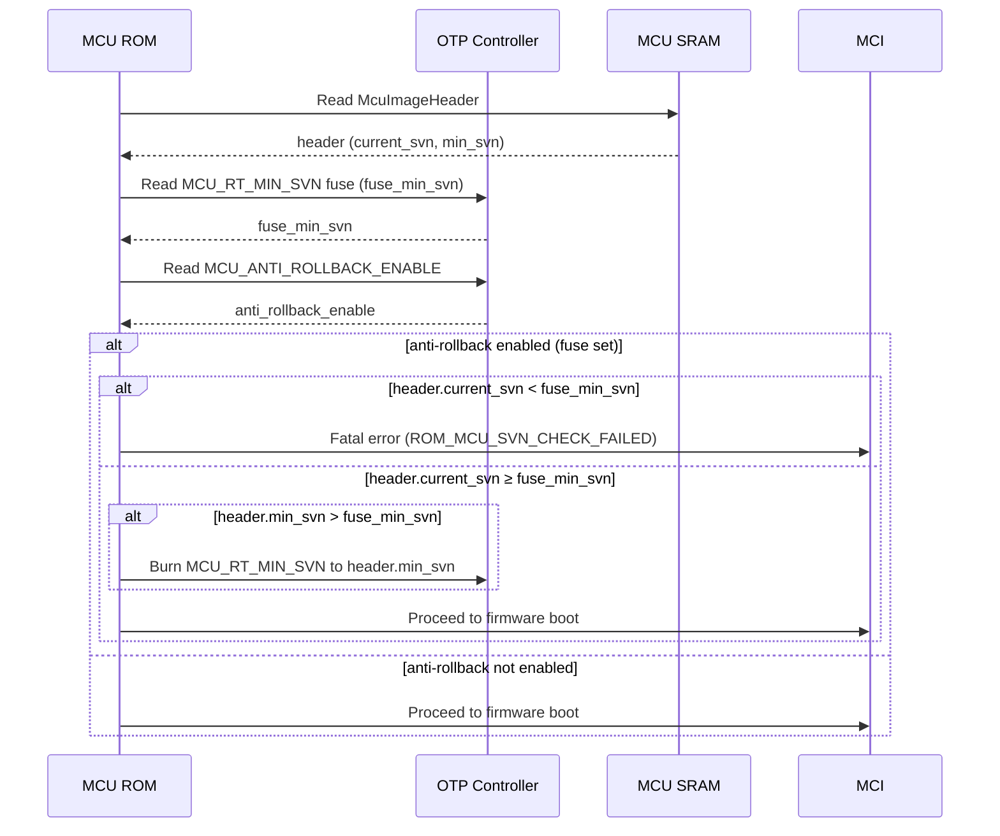
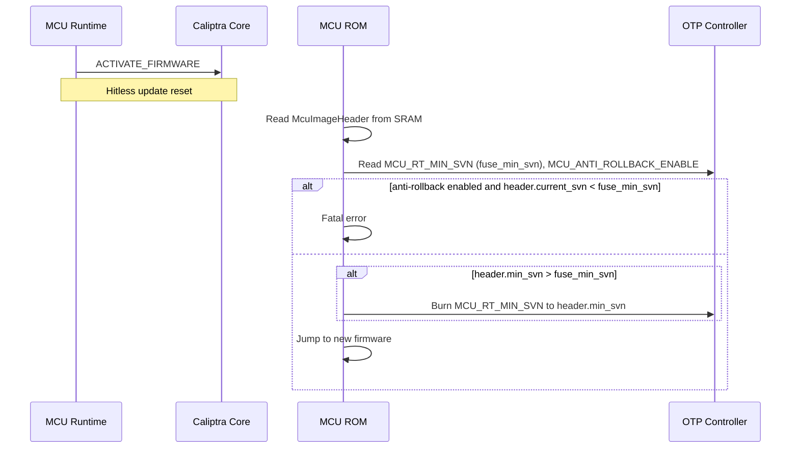
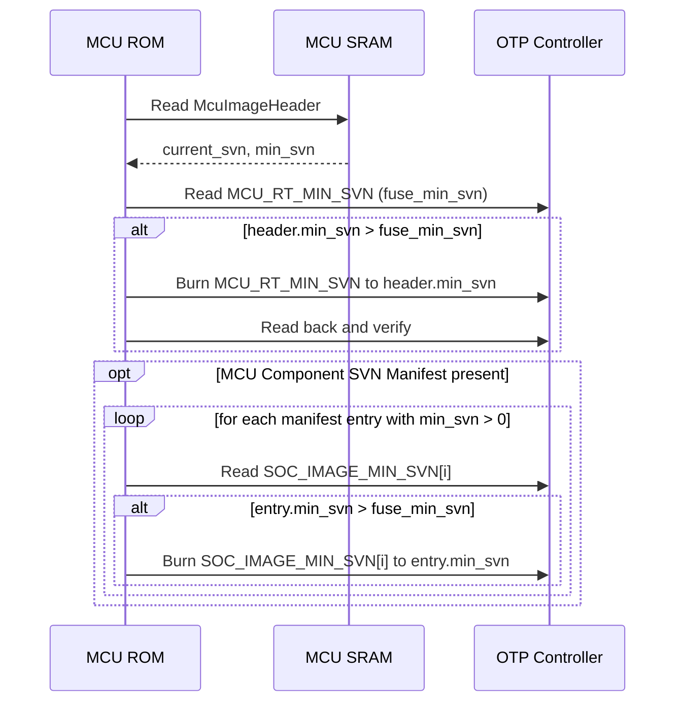

# Security Version Number (SVN) Anti-Rollback Specification

## Overview

Security Version Numbers (SVNs) provide anti-rollback protection for firmware
running on the Caliptra subsystem. Each firmware component tracks two SVN
values:

- **`current_svn`** — the security version of the running firmware image,
  declared by the image itself. This is purely informational for attestation and
  versioning.
- **`min_svn`** — the minimum acceptable security version, stored in OTP fuses.
  Any image with `current_svn < min_svn` is rejected.

Only `min_svn` is burned into OTP fuses. The `min_svn` value is set
independently of `current_svn` — a firmware release may carry
`current_svn = 10` but only request `min_svn = 7`, allowing the deployer to
maintain rollback capability to versions 7–9 while running version 10. This
separation gives deployers control over when to permanently commit to a
minimum version.

This document describes SVN enforcement for three categories of components:

1. **Caliptra Core firmware** (FMC, Runtime) — SVN enforcement is performed by
   the Caliptra Core ROM during its own boot.
2. **MCU Runtime firmware** — SVN enforcement is performed by the MCU ROM before
   jumping to MCU firmware.
3. **SoC component images** — The SoC manifest carries a single SVN enforced by
   Caliptra Core. Optionally, MCU can enforce per-component SVN checks
   using an MCU-managed component SVN manifest and dedicated fuses.

## Threat Model

SVN anti-rollback prevents an attacker who can manipulate the firmware delivery
path (e.g., flash contents, recovery interface, network boot server) from
downgrading firmware to an older version with known vulnerabilities. Without SVN
enforcement, an attacker could replace current firmware with a signed-but-older
image that contains exploitable bugs.

SVN enforcement relies on:

- OTP fuses as a tamper-resistant monotonic store
- Authenticated firmware images that carry a declared SVN
- ROM or runtime code that compares and enforces the SVN before executing or
  loading the image

## SVN Fuse Architecture

### Existing Caliptra Core SVN Fuses

The following SVN fuses already exist in the `SVN_PARTITION` (partition 8) of
the OTP fuse map and are owned by the Caliptra Core:

| Fuse Field | Size | Purpose |
|---|---|---|
| `CPTRA_CORE_FMC_KEY_MANIFEST_SVN` | 4 bytes | Anti-rollback for the Caliptra FMC key manifest |
| `CPTRA_CORE_RUNTIME_SVN` | 16 bytes | Anti-rollback for the Caliptra Runtime firmware |
| `CPTRA_CORE_SOC_MANIFEST_SVN` | 16 bytes | Anti-rollback for the SoC manifest |
| `CPTRA_CORE_SOC_MANIFEST_MAX_SVN` | 4 bytes | Maximum allowed SVN for the SoC manifest |

These fuses are read by MCU ROM during cold boot and written to Caliptra Core's
fuse registers. Caliptra Core ROM enforces anti-rollback for its own firmware
using these values. See [ROM Fuses](rom-fuses.md) for encoding details.

The `CPTRA_CORE_ANTI_ROLLBACK_DISABLE` fuse in `sw_manuf_partition` (partition
6) can disable Caliptra Core's anti-rollback enforcement entirely. When set,
Caliptra Core will not reject firmware with a lower SVN. This is a pre-existing
Caliptra Core fuse that MCU ROM passes through without interpretation.

> **Note:** The MCU-side anti-rollback fuse uses the opposite polarity —
> `MCU_ANTI_ROLLBACK_ENABLE` — following the principle that burning a fuse
> should only make a device *more* secure, never less. Since OTP bits can only
> transition 0→1, an "enable" fuse means enforcement can be permanently
> activated but never deactivated.

### New MCU SVN Fuses

To provide anti-rollback protection for MCU Runtime firmware and SoC component
images, the following new fuse fields are required. These should be added to a
vendor-defined partition (e.g., `VENDOR_NON_SECRET_PROD_PARTITION`) or to a new
dedicated MCU SVN partition, depending on the integrator's fuse budget.

| Fuse Field | Size | Encoding | Purpose |
|---|---|---|---|
| `MCU_RT_MIN_SVN` | 16 bytes | `OneHotLinearMajorityVote{bits:N, dupe:3}` | Minimum acceptable SVN for MCU Runtime firmware |
| `SOC_IMAGE_MIN_SVN[0..M]` | 4 bytes each | `OneHotLinearMajorityVote{bits:N, dupe:3}` | Minimum acceptable SVN for each SoC component image |
| `MCU_ANTI_ROLLBACK_ENABLE` | 1 byte | `LinearMajorityVote{bits:1, dupe:3}` | Enable MCU-side anti-rollback enforcement (burned during provisioning) |

The exact number of `SOC_IMAGE_MIN_SVN` slots (`M`) depends on the integrator's
SoC image configuration and is defined in the platform's fuse definition file.
Each slot corresponds to a component identifier in the SVN Fuse Map.

#### Fuse Encoding Rationale

SVN fuses use `OneHotLinearMajorityVote` encoding because:

- **OneHot** allows incrementing the SVN by burning a single additional fuse bit,
  which is a safe monotonic operation on OTP.
- **LinearMajorityVote** with 3× duplication provides fault tolerance against
  single-bit read errors without requiring ECC (which is incompatible with
  fields that are written more than once).

See [Fuse Layout Options](fuses.md#fuse-layout-options) for encoding details.

#### OTP Encoding Recommendations

| Fuse Field | ECC | Recommended Layout |
|---|:---:|---|
| `MCU_RT_MIN_SVN` | ❌ | `OneHotLinearMajorityVote{bits:N, dupe:3}` |
| `SOC_IMAGE_MIN_SVN[i]` | ❌ | `OneHotLinearMajorityVote{bits:N, dupe:3}` |
| `MCU_ANTI_ROLLBACK_ENABLE` | ✅ | `LinearMajorityVote{bits:1, dupe:3}` or `Single{bits:1}` with ECC |

The `MCU_ANTI_ROLLBACK_ENABLE` fuse is write-once and can use ECC. SVN counter
fuses must not use ECC because they are updated in the field.

## MCU Image Header

The MCU Runtime binary includes an `McuImageHeader` at the start of the image.
This header carries the image's current and minimum SVN values:

| Field | Size | Description |
|---|---|---|
| `current_svn` | 2 bytes | Security version of this MCU Runtime image |
| `min_svn` | 2 bytes | Requested minimum SVN to burn into OTP (0 = no update requested) |
| `reserved` | 4 bytes | Reserved for future use |

- `current_svn` is the version of the image for enforcement and attestation. ROM
  rejects the image if `current_svn < fuse_min_svn`.
- `min_svn` is the value ROM should burn into the `MCU_RT_MIN_SVN` fuse. ROM only
  burns if `min_svn > fuse_min_svn`. A value of 0 means no fuse update is
  requested. `min_svn` must be ≤ `current_svn`.

Both values are set at build time via the firmware bundler (e.g.,
`--svn <current>` and `--min-svn <min>`) and embedded in the binary before
signing.

## SoC Image SVN Tracking

The SoC manifest carries a single SVN for the manifest as a whole
(`CPTRA_CORE_SOC_MANIFEST_SVN`), which is enforced by Caliptra Core. There is no
per-component SVN in the SoC manifest itself.

To provide per-component anti-rollback for individual SoC images, the MCU SDK
supports an optional **MCU Component SVN Manifest** — a small data structure
managed by MCU firmware that maps each SoC component identifier to an SVN value.

### MCU Component SVN Manifest (Optional)

| Field | Size | Description |
|---|---|---|
| Magic | 4 bytes | Identifier `0x4D435356` (`"MCSV"`) |
| Version | 2 bytes | Manifest format version |
| Entry Count | 2 bytes | Number of component SVN entries |
| Entries | 12 bytes × N | Array of `(component_id: u32, current_svn: u32, min_svn: u32)` tuples |

Each entry carries both the component's `current_svn` (for enforcement — reject
if below fuse) and `min_svn` (for fuse burning — the new floor to commit to).
`min_svn` must be ≤ `current_svn`. A `min_svn` of 0 means no fuse update is
requested for that component.

When present, MCU Runtime uses this manifest to enforce per-component SVN checks
against the `SOC_IMAGE_MIN_SVN[i]` fuses during image loading. When absent, only the
SoC manifest-level SVN (enforced by Caliptra Core) provides anti-rollback
protection for SoC images, and the `SOC_IMAGE_MIN_SVN` fuses are not used.

This is an optional extension — integrators who do not need per-component SoC
image anti-rollback can omit both the MCU Component SVN Manifest and the
`SOC_IMAGE_MIN_SVN` fuses.

### Loading and Authenticating the Component SVN Manifest

The MCU Component SVN Manifest is treated as a SoC image within the standard
firmware bundle. It is listed in the SoC manifest with its own component
identifier (e.g., a reserved identifier such as `0x00000003` or a
vendor-assigned value) and digest, alongside the other SoC images.

During boot or firmware update, the manifest is delivered and authenticated using
the same mechanisms as any other SoC image:

**Recovery / Cold Boot Flow:**

1. The MCU Component SVN Manifest is included in the flash image or streamed via
   the recovery interface alongside the other SoC images.
2. Caliptra Runtime loads the manifest data via the recovery interface registers
   and writes it to an MCU-accessible location (e.g., MCU SRAM or a
   DMA-accessible buffer).
3. MCU Runtime issues an `AUTHORIZE_AND_STASH` mailbox command to Caliptra,
   referencing the component identifier assigned to the SVN manifest. Caliptra
   hashes the image, verifies the digest against the SoC manifest entry, and
   stashes the measurement.
4. If authorization succeeds, MCU Runtime parses the manifest and caches the
   per-component SVN entries for use during subsequent SoC image loading.
5. If authorization fails, MCU Runtime treats the manifest as absent —
   per-component SVN enforcement is not applied, and an error is logged.

**PLDM Firmware Update Flow:**

1. The MCU Component SVN Manifest is included as a component in the PLDM
   firmware update package, delivered by the Update Agent alongside the other
   firmware components.
2. The manifest is written to the staging area and verified as part of the
   normal PLDM component verification sequence.
3. During the apply phase, MCU Runtime issues `AUTHORIZE_AND_STASH` to Caliptra
   for the SVN manifest component, following the same flow as above.

**Hitless Update Flow:**

1. When new firmware is activated via hitless update, the updated MCU Component
   SVN Manifest (if present in the new bundle) is authorized and loaded after
   MCU Runtime boots with the new firmware.



Because the MCU Component SVN Manifest is authenticated through the same
Caliptra `AUTHORIZE_AND_STASH` path as all other SoC images, its integrity is
rooted in the same trust chain — the SoC manifest signature verified by Caliptra
Core. An attacker cannot forge or tamper with the SVN manifest without also
compromising the SoC manifest signature.

## Enforcement Flows

### Cold Boot — Caliptra Core SVNs

During cold boot, MCU ROM reads the Caliptra Core SVN fuses from OTP and writes
them to Caliptra Core's fuse registers. Caliptra Core ROM then enforces
anti-rollback internally:

1. MCU ROM reads `CPTRA_CORE_FMC_KEY_MANIFEST_SVN`, `CPTRA_CORE_RUNTIME_SVN`,
   `CPTRA_CORE_SOC_MANIFEST_SVN`, and `CPTRA_CORE_SOC_MANIFEST_MAX_SVN` from
   OTP.
2. MCU ROM writes these values to the corresponding Caliptra fuse registers.
3. Caliptra Core ROM authenticates its firmware bundle and compares the
   image-declared SVN against the fuse SVN.
4. If image SVN < fuse SVN, Caliptra Core rejects the firmware.
5. If image SVN ≥ fuse SVN, Caliptra Core boots the firmware.
6. If image SVN > fuse SVN and `CPTRA_CORE_ANTI_ROLLBACK_DISABLE` is not set,
   Caliptra Core updates the SVN fuse in OTP to match the image SVN.

MCU ROM has no role in enforcing Caliptra Core SVN policy — it only transports
fuse values from OTP to Caliptra registers.

### Cold Boot — MCU Runtime SVN

After Caliptra Core loads the MCU Runtime image into MCU SRAM, MCU ROM enforces
the MCU SVN before jumping to firmware:

1. MCU ROM waits for Caliptra to signal that MCU firmware is ready in SRAM.
2. MCU ROM reads the `McuImageHeader` from the start of the loaded image.
3. MCU ROM reads `MCU_RT_MIN_SVN` (the fused `min_svn`) from OTP and decodes it.
4. MCU ROM reads `MCU_ANTI_ROLLBACK_ENABLE` from OTP.
5. If anti-rollback is enabled (fuse is set):
   - If `header.current_svn < fuse_min_svn`: MCU ROM rejects the image and
     reports a fatal error (`ROM_MCU_SVN_CHECK_FAILED`). The device does not
     boot.
   - If `header.current_svn ≥ fuse_min_svn`: MCU ROM proceeds.
6. MCU ROM checks if a `min_svn` fuse burn is needed (see
   [SVN Fuse Update Flow](#svn-fuse-update-flow)).
7. MCU ROM triggers a reset to enter the Firmware Boot flow, which jumps to the
   MCU Runtime.



### Firmware Boot — SVN Check on Jump

During the Firmware Boot flow (entered after cold boot triggers a reset), MCU
ROM performs a lightweight validation before jumping to firmware. The SVN check
has already been performed during the cold boot flow and does not need to be
repeated here, since SRAM contents have not changed.

### Hitless Firmware Update — MCU Runtime SVN

When an MCU Runtime update is applied via the hitless update mechanism:

1. MCU Runtime receives a firmware update via PLDM T5.
2. MCU Runtime sends the new firmware bundle to Caliptra for verification.
3. Caliptra authenticates the bundle and loads the new MCU Runtime to SRAM.
4. MCU Runtime triggers a hitless update reset.
5. MCU ROM enters the Hitless Firmware Update flow.
6. MCU ROM reads the `McuImageHeader` from the new image in SRAM.
7. MCU ROM reads `MCU_RT_MIN_SVN` and `MCU_ANTI_ROLLBACK_ENABLE` from OTP.
8. If anti-rollback is enabled and `header.current_svn < fuse_min_svn`:
   - MCU ROM rejects the update and reports a fatal error. The device must
     recover by loading firmware with an acceptable SVN.
9. If `header.current_svn ≥ fuse_min_svn`:
   - If `header.min_svn > fuse_min_svn`: MCU ROM burns the `MCU_RT_MIN_SVN` fuse
     to `header.min_svn`.
   - MCU ROM jumps to the new firmware.



### Runtime — SoC Image SVN Enforcement (Optional)

When the MCU Component SVN Manifest is present and `SOC_IMAGE_MIN_SVN` fuses are
provisioned, MCU Runtime enforces per-component SVN checks during image loading:

1. MCU Runtime authenticates the MCU Component SVN Manifest (e.g., by verifying
   its digest against a value in the SoC manifest or via a Caliptra mailbox
   command).
2. For each SoC image to be loaded:
   a. MCU Runtime looks up the image's component identifier in the MCU Component
      SVN Manifest to obtain its `current_svn`.
   b. MCU Runtime reads the corresponding `SOC_IMAGE_MIN_SVN[i]` fuse (`fuse_min_svn`)
      from OTP.
   c. If `current_svn < fuse_min_svn`: the image is rejected and not loaded to
      the target SoC component. An error is reported.
   d. If `current_svn ≥ fuse_min_svn`: the image is loaded normally.
3. The mapping from component identifiers to `SOC_IMAGE_MIN_SVN` fuse slots is
   defined by the platform configuration.

If the MCU Component SVN Manifest is not present, per-component SVN enforcement
is skipped. Anti-rollback for SoC images in this case relies solely on the
SoC manifest-level SVN enforced by Caliptra Core.

## SVN Fuse Update Flow

SVN `min_svn` fuses are **only burned by MCU ROM** — never by MCU Runtime or
any other software. This ensures fuse programming occurs in the most trusted
execution context, before mutable firmware has control of the system.

### Principles

- Fuses store `min_svn`, not `current_svn`. The fused value is a floor — it
  does not track what is currently running, only what the minimum acceptable
  version is.
- `min_svn` is set independently by the firmware deployer. A firmware image with
  `current_svn = 10` may request `min_svn = 7`, preserving the ability to roll
  back to versions 7–9.
- Fuse burns are monotonic: ROM only burns if the requested `min_svn` strictly
  exceeds the current fuse value. The burn is idempotent and power-fail safe
  (one-hot encoding means partial burns cannot decrease the value).

### Trigger 1: Firmware Image SVN Section (Primary Mechanism)

The primary trigger for `min_svn` fuse updates is the firmware image itself.
When MCU ROM boots a new image (on cold boot or hitless update reset), it reads
the `min_svn` fields from the authenticated image and burns fuses if needed.

**MCU Runtime `min_svn`:**

1. MCU ROM reads the `McuImageHeader` from the loaded image in SRAM.
2. MCU ROM compares `header.min_svn` against the current `MCU_RT_MIN_SVN` fuse
   value.
3. If `header.min_svn > fuse_min_svn` and `MCU_ANTI_ROLLBACK_ENABLE` is set:
   a. MCU ROM burns additional one-hot bits in the `MCU_RT_MIN_SVN` fuse to
      represent `header.min_svn`.
   b. MCU ROM reads back the fuse and verifies the update.
4. If `header.min_svn ≤ fuse_min_svn` or `header.min_svn == 0`: no burn.

**SoC Component `min_svn`:**

1. MCU ROM reads the MCU Component SVN Manifest (if present and previously
   authenticated by Caliptra via `AUTHORIZE_AND_STASH`).
2. For each entry in the manifest where `min_svn > 0`:
   a. MCU ROM looks up the component's fuse slot in the SVN Fuse Map.
   b. MCU ROM compares `entry.min_svn` against the current `SOC_IMAGE_MIN_SVN[i]`
      fuse value.
   c. If `entry.min_svn > fuse_min_svn`: MCU ROM burns the fuse.
3. If the manifest is absent, no SoC component fuses are burned.



### Trigger 2: Runtime-Stashed SVN Update Request (Experimental)

In some deployments, an operator may need to advance `min_svn` fuses without
deploying a new firmware image — for example, after confirming that an older
firmware version has a critical vulnerability and should be permanently blocked.

In this flow, MCU Runtime receives an authenticated command (e.g., via an SPDM
vendor-defined message) requesting a `min_svn` update for one or more
components. Since only ROM can burn fuses, MCU Runtime must stash the request
for ROM to process on the next reset.

**Conceptual flow:**

1. MCU Runtime receives an authenticated `SET_MIN_SVN` command over a secure
   channel (e.g., SPDM VDM, authenticated mailbox).
2. MCU Runtime validates the request: the requested `min_svn` must be
   ≤ `current_svn` for each component.
3. MCU Runtime writes the SVN update request to a stash location and triggers a
   reset.
4. On the next boot, MCU ROM reads the stash, validates the entries, and burns
   the requested `min_svn` values.
5. MCU ROM clears the stash after processing.

> **⚠ Open Problem: Stash Protection**
>
> The stash location must survive reset but also be protected against tampering.
> Possible approaches include:
>
> - **MCI mailbox SRAM**: Survives MCU reset, but any AXI-accessible agent could
>   potentially write to it. Would need the request to be cryptographically
>   signed so ROM can verify authenticity.
> - **Caliptra-managed storage**: MCU Runtime could ask Caliptra to store the
>   request (e.g., via a mailbox command). ROM would retrieve it from Caliptra
>   after the next boot. This provides better protection but requires Caliptra
>   support.
> - **Authenticated and integrity-protected blob**: The stash is HMAC'd or
>   signed using a key known to Caliptra, and ROM verifies the signature before
>   processing. This allows any storage location to be used safely.
>
> Until the stash protection mechanism is defined and implemented, this trigger
> is considered **experimental** and should not be relied upon for production
> deployments. The firmware image SVN section (Trigger 1) is the recommended
> mechanism.

### When SVN Fuses Are Updated

| Component | Who Burns Fuse | Trigger | When |
|---|---|---|---|
| Caliptra Core FMC/RT | Caliptra Core ROM | Caliptra's own image SVN | During Caliptra boot |
| MCU Runtime | MCU ROM | `McuImageHeader.min_svn` | Cold boot or hitless update reset |
| SoC images (optional) | MCU ROM | MCU Component SVN Manifest `min_svn` | Cold boot or hitless update reset |
| Any component | MCU ROM | Runtime-stashed request (experimental) | Next boot after stash |

## Platform Configuration

Integrators must define the following in their platform configuration:

### Fuse Definition (vendor_fuses.hjson)

```js
{
  non_secret_vendor: [
    {"mcu_rt_min_svn": 16},           // 16 bytes for MCU RT min SVN
    {"soc_image_min_svn_0": 4},       // 4 bytes per SoC image min SVN slot
    {"soc_image_min_svn_1": 4},
    // ... additional slots as needed
    {"mcu_anti_rollback_enable": 1}
  ],
  fields: [
    {name: "mcu_rt_min_svn", bits: 32},  // logical min SVN range 0..32
    {name: "soc_image_min_svn_0", bits: 8},
    {name: "soc_image_min_svn_1", bits: 8},
    {name: "mcu_anti_rollback_enable", bits: 1}
  ]
}
```

The actual bit counts and number of SoC image SVN slots are
integrator-defined based on the expected firmware update frequency over the
device lifetime and the number of SoC components.

### Component SVN Fuse Map

ROM and MCU Runtime must be compiled with a static mapping from SVN component
identifiers to OTP fuse entries. This map tells ROM which fuse slot backs each
component's `min_svn`, and is used for both the MCU Runtime SVN check and the
per-component SoC image SVN checks.

The map is defined as a platform-specific constant table:

```rust
/// Maps a component identifier to its OTP fuse entry for min_svn storage.
pub struct SvnFuseMapEntry {
    /// Component identifier (matches the MCU Component SVN Manifest).
    /// Use a well-known value (e.g., 0x00000002) for the MCU Runtime itself.
    pub component_id: u32,
    /// Reference to the generated OTP fuse entry for this component's min_svn.
    pub fuse_entry: &'static FuseEntryInfo,
}

/// Platform-defined SVN fuse map, compiled into ROM and runtime.
pub static SVN_FUSE_MAP: &[SvnFuseMapEntry] = &[
    SvnFuseMapEntry {
        component_id: 0x0000_0002, // MCU RT
        fuse_entry: &OTP_MCU_RT_MIN_SVN,
    },
    SvnFuseMapEntry {
        component_id: 0x0000_1000, // SoC image 0
        fuse_entry: &OTP_SOC_IMAGE_MIN_SVN_0,
    },
    SvnFuseMapEntry {
        component_id: 0x0000_1001, // SoC image 1
        fuse_entry: &OTP_SOC_IMAGE_MIN_SVN_1,
    },
    // ... additional entries as needed
];
```

ROM uses this map to resolve fuse entries for both SVN enforcement (comparing
`current_svn` against the fused `min_svn`) and fuse burning (writing a new
`min_svn` from the image header or manifest).

If a component identifier from the MCU Component SVN Manifest does not have a
corresponding entry in the fuse map, MCU Runtime skips per-component SVN
enforcement for that component and logs a warning. This allows the manifest to
list components that do not yet have dedicated fuse slots without causing boot
failures.

### McuImageHeader SVN Assignment

The firmware bundler sets both `current_svn` and `min_svn` in the
`McuImageHeader` (e.g., `--svn <current>` and `--min-svn <min>`). The build
system must increment `current_svn` for each security-relevant release.
`min_svn` should be set to the oldest version that the deployer considers
acceptable — this is a deployment policy decision, not necessarily tied to the
current version.

### ImageVerifier Implementation

Each platform must implement the `ImageVerifier` trait to perform SVN
enforcement in ROM. The reference implementation reads the `McuImageHeader`,
extracts the SVN, reads the corresponding OTP fuse, and compares:

```rust
impl ImageVerifier for McuImageVerifier {
    fn verify_header(&self, header: &[u8], otp: &Otp) -> bool {
        let Ok((header, _)) = McuImageHeader::ref_from_prefix(header) else {
            return false;
        };
        let Ok(fuse_min_svn) = otp.read_mcu_rt_min_svn() else {
            return false;
        };
        if otp.read_mcu_anti_rollback_enable().unwrap_or(0) == 0 {
            return true; // anti-rollback not yet enabled
        }
        header.current_svn >= fuse_min_svn
    }
}
```

## Security Considerations

### min_svn vs current_svn Separation

The separation of `min_svn` (fuse floor) from `current_svn` (image version)
gives deployers explicit control over the anti-rollback commitment. This is
important because:

- A deployer may want to test a new firmware version before permanently
  committing to it as the minimum. By setting `min_svn` lower than
  `current_svn`, rollback to known-good versions remains possible.
- Once a vulnerability is confirmed in older versions, the deployer releases a
  firmware image (or sends an authenticated command) with `min_svn` raised to
  permanently block those versions.
- The OTP fuse only stores the floor — it does not leak information about what
  version is currently running.

### ROM-Only Fuse Burning

Only MCU ROM burns `min_svn` fuses. This ensures:

- Fuse programming runs in the most trusted execution context (immutable ROM)
  before mutable firmware has control.
- MCU Runtime cannot be exploited to burn fuses to attacker-chosen values.
- The attack surface for fuse manipulation is limited to the authenticated
  firmware image (which is signed) or the experimental stash mechanism (which
  requires cryptographic authentication).

### One-Way Commitment

OTP fuses can only be burned from 0→1 (or equivalently, `min_svn` can only
increase). There is no mechanism to decrease a `min_svn` value. If a firmware
release with a given `min_svn` is found to be incorrect, the only remedy is to
release new firmware with `current_svn ≥` the committed `min_svn`.

### Anti-Rollback Enable Fuse

The `MCU_ANTI_ROLLBACK_ENABLE` fuse must be burned during device provisioning
before the device enters production. Once set, anti-rollback enforcement is
permanently active and cannot be turned off — OTP fuses can only transition
0→1, so there is no mechanism to disable enforcement after it has been enabled.

On unprogrammed devices (development, early manufacturing), the fuse defaults to
0 and anti-rollback is not enforced, allowing unrestricted firmware iteration.
The lifecycle controller's transition from manufacturing to production should
verify that this fuse has been set.

### SVN Exhaustion

The maximum `min_svn` value is limited by the number of fuse bits allocated.
With one-hot encoding:

- 32 bits → max SVN of 32
- 128 bits → max SVN of 128

Integrators must allocate enough bits for the expected number of `min_svn`
advances over the device's operational lifetime. Note that `min_svn` advances
are typically far less frequent than firmware releases, since `current_svn` can
increase without advancing `min_svn`. If `min_svn` reaches its maximum value,
no further anti-rollback updates are possible, but the device continues to
enforce the maximum `min_svn`.

### Interaction with Device Ownership Transfer

SVN fuses are orthogonal to device ownership. Ownership transfer (DOT) does not
reset or modify `min_svn` values. A new owner inherits the device's current
`min_svn` state and must provide firmware with `current_svn ≥` the committed
values.
